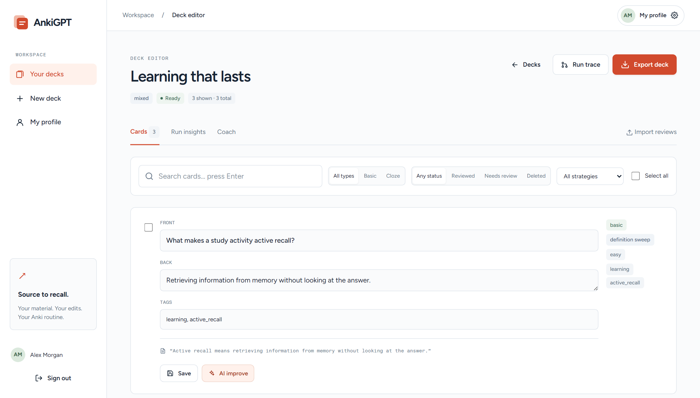
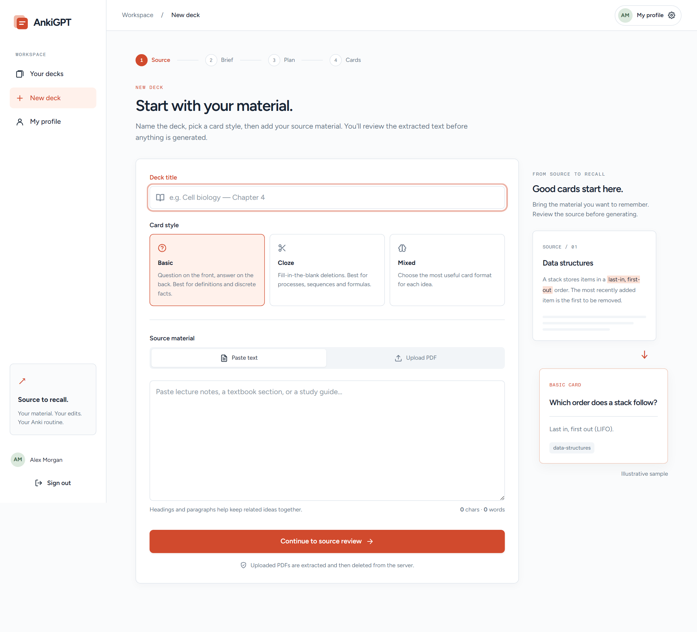
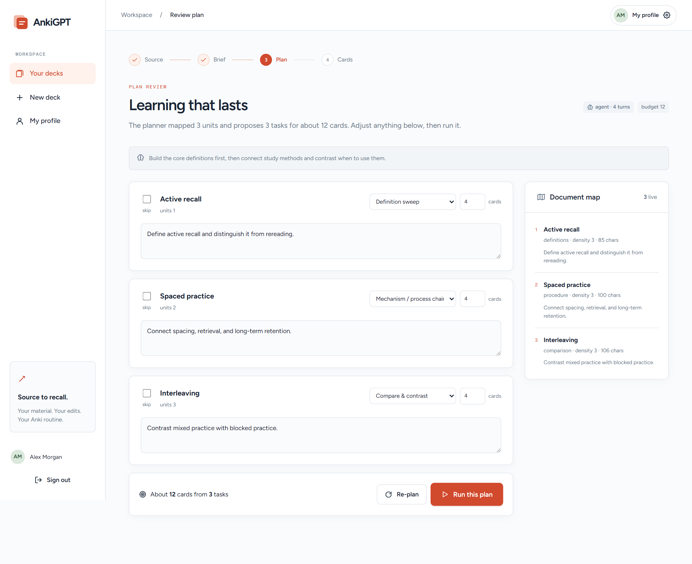

# AnkiGPT

### Your material. Your edits. Your Anki routine.

Turn PDFs and notes into editable flashcards. Brief the planner, review its work,
refine the cards, and export a deck you can study in Anki.

[Get started](#get-started) · [User guide](docs/user-guide.md) · [Configuration](docs/setup.md) · [How it works](docs/architecture.md)



*The real card editor with synthetic study material. All screenshots show the current
interface with sample data, not results from a live AI run.*

## From source to study

1. **Add your material.** Paste notes or upload a text-based PDF, optionally choosing a
   page range. Pick basic, cloze, or mixed cards.
2. **Set the direction.** Review the extracted source and tell the planner your exam
   context, focus areas, exclusions, must-include terms, and approximate deck size.
3. **Review the plan.** Optionally pause before writing to change strategies, adjust
   card budgets, edit worker notes, or skip tasks.
4. **Make the cards yours.** Search, filter, edit, tag, restore, or AI-improve cards.
   Use source quotes and critic notes to check them, then export `.apkg` to Anki.
5. **Improve after studying.** Import Anki review history and use Coach to rewrite or
   split struggling cards. Review its suggestions before exporting again.

### Start with your material



### Shape the plan before cards are written



## What happens behind the scenes

The pipeline maps the source into units, plans specialist tasks, and writes cards in
parallel. Optional vision analysis turns useful PDF figures into image-backed cards.
A critic checks generated cards; duplicate reconciliation and a coverage pass refine
the deck. The live run trace and **Run insights** expose task status, tokens, and
recorded costs. [Read the pipeline reference →](docs/architecture.md)

**You stay in control:** only cards with `ok` status (shown as **Reviewed** in the
filter) export. Deleted and Needs review cards are excluded. The label is a workflow
state, not a guarantee of human review or factual accuracy.

## Get started

Use **Python 3.12** (the version used by the Docker image), an **OpenRouter API key**
for AI operations, and **Anki** to study exported packages.

### Local · PowerShell

Run from the repository root:

```powershell
python -m venv .venv
.\.venv\Scripts\Activate.ps1
pip install -r requirements.txt
Copy-Item example.env .env
python -c "import secrets; print(secrets.token_urlsafe(48))"
```

Edit `.env`: set `SECRET_KEY` to the generated value and add your
`OPENROUTER_API_KEY`. If `.env` already exists, update it instead of copying over it.
Then start the app:

```powershell
python run.py
```

Open [localhost:5000](http://127.0.0.1:5000), create an account, and choose **New deck**.
The workspace requires sign-in; the landing page has a public illustrative sample.
**My profile** manages your display name, bio, avatar color, email, and password.

### Docker

After configuring `.env` as above:

```bash
docker compose up --build
```

Open [localhost:5000](http://localhost:5000). Compose runs one web container and
persists local SQLite data in the `ankigpt-data` volume. PostgreSQL, including Neon,
is supported through `DATABASE_URL`.

## Practical details

- **Input:** text and text-based PDFs; no OCR workflow. Defaults: 50 MB upload limit
  and 400,000 source characters. Longer sources are truncated with a warning.
- **Models:** the configured default is `openai/gpt-5.6-luna`, with per-role overrides.
  Model access and billing depend on your OpenRouter account. Repeated tasks can use
  cached results, but a rerun is not guaranteed to be free.
- **Runtime:** generation runs in background threads inside the web process. You can
  close the page while it works; restarting the server interrupts the run.
- **Data:** workspace routes enforce account ownership. AI operations send source
  content through OpenRouter. Extracted text, figures, cards, and traces are stored
  in your database. The original uploaded PDF is removed after extraction.
- **Anki:** export and review import are manual file transfers. Export includes all
  `ok` cards in the deck, even when the editor is filtered.

## Documentation

| Guide | What's inside |
|---|---|
| [User guide](docs/user-guide.md) | Source → brief → plan → editor → export, Coach, profiles, troubleshooting |
| [Setup and configuration](docs/setup.md) | Local/Docker setup, environment variables, Neon migration, deployment and storage |
| [Architecture](docs/architecture.md) | Pipeline phases, strategies, caching, data model, failure handling |
| [Development](docs/development.md) | Stack, tests, routes, and reproducible screenshot capture |

## Development checks

```powershell
pip install -r requirements-dev.txt
python -m pytest tests/ -q
```

The scripted model tests exercise the pipeline without calling a live AI provider.
