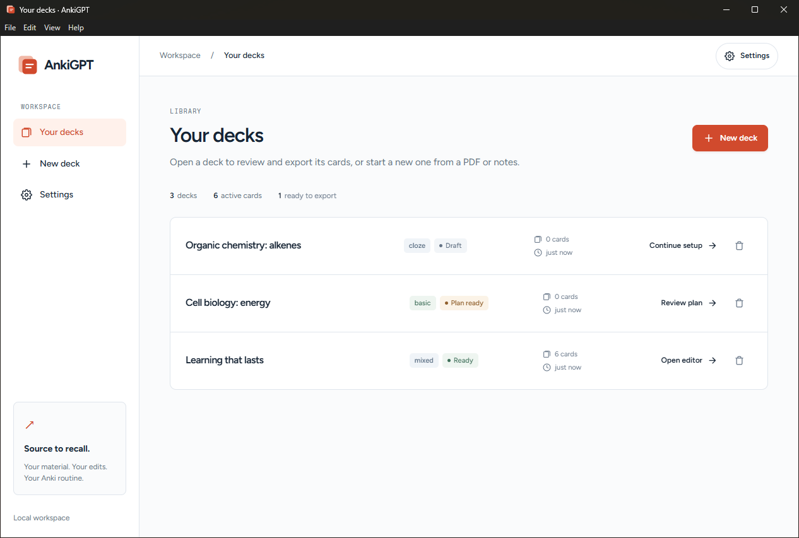
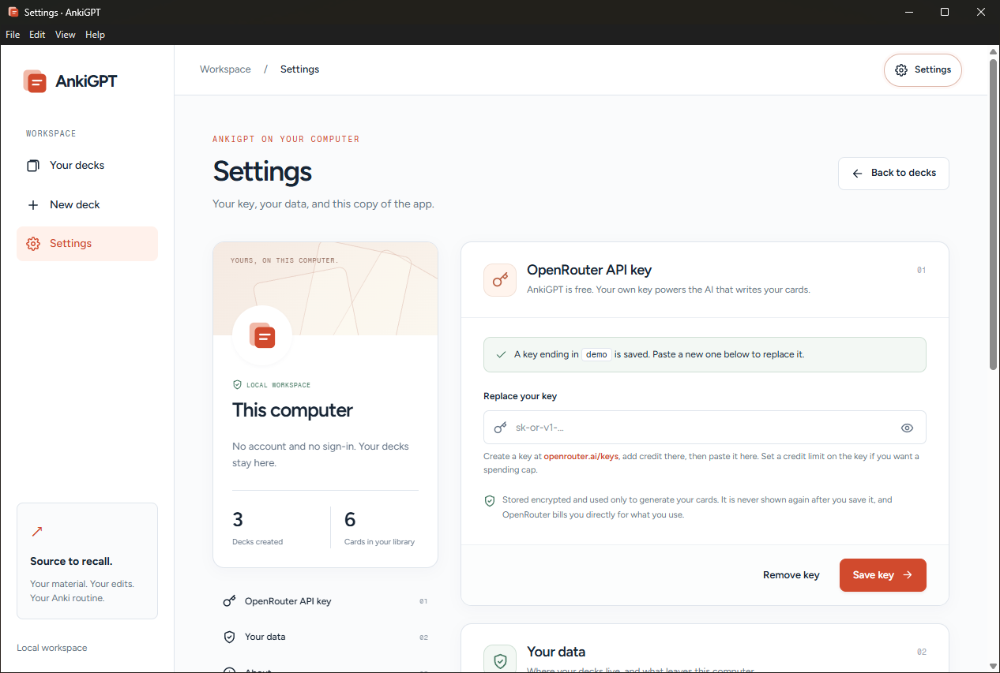
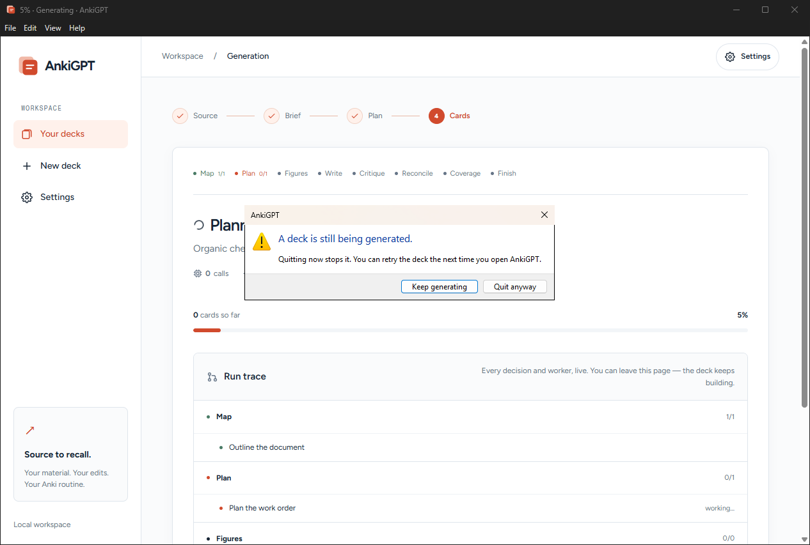

# AnkiGPT Desktop

[README](../README.md) · [User guide](user-guide.md) · [Setup](setup.md) · [Architecture](architecture.md) · [Development](development.md)

AnkiGPT Desktop is the same app as a Windows program. It runs on your own computer
with no server, no account and no sign-in: install it, add your OpenRouter key, and
make a deck. The design is written up in [desktop-app/SPEC.md](../desktop-app/SPEC.md).



*The desktop app with synthetic sample decks. No model was called to make them.*

## Installing

1. Download `AnkiGPT-Setup-<version>.exe` from the
   [latest release](https://github.com/AshtonLong/AnkiGPT/releases/latest). It needs
   64-bit Windows 10 or 11.
2. Run it. The installer is not code-signed yet, so Windows shows "Windows protected
   your PC": choose **More info → Run anyway**. It installs for your user account only
   and does not ask for administrator rights.
3. Open **Settings** (`Ctrl+,`) and paste your [OpenRouter](https://openrouter.ai/keys)
   key.

## Using it

Everything in the [user guide](user-guide.md) applies, with these differences:

- **No account.** There is nothing to sign up for or sign in to. Decks belong to this
  computer.
- **Settings instead of My profile.** Add your OpenRouter key under **Settings**
  (`Ctrl+,`). The page also shows where your data is stored and the app version.
- **Export saves a file.** **Export deck** opens a Save dialog in your Downloads folder.
  When the file is written you can choose **Open in Anki**, which hands the package to
  Anki to import, or **Show in folder**.
- **Closing the window quits the app.** Generation stops when the app closes, so the app
  asks before quitting while a deck is being generated. A deck that was cut off shows
  as failed the next time you open the app, with **Retry generation**.
- **Bigger uploads.** PDFs up to 200 MB. The 400,000 character source limit still applies.
- **Updates install themselves.** The app checks GitHub for a new version shortly after
  it starts and every six hours, downloads it in the background, and offers to restart.
  **Help → Check for updates…** checks at once.





## Your data

Everything is kept in `%APPDATA%\AnkiGPT`, which you can open with
**File → Open data folder** and **Help → Open logs folder**:

```text
%APPDATA%\AnkiGPT\
  data\
    ankigpt.db           your decks and cards, and your OpenRouter key (encrypted)
    backups\             a copy of the database from before each upgrade (three kept)
    settings.env         optional advanced settings (see below)
  logs\
    main.log             the app
    backend.log          deck generation and everything else
  secret.bin             the key that protects your OpenRouter key, encrypted by Windows
```

- Source material and cards are sent to OpenRouter, under your key, when you generate,
  improve or coach. Nothing is sent to an AnkiGPT server, and the app reports nothing
  about how you use it. It contacts GitHub to check for updates.
- To back up your decks, close the app and copy the `data` folder.
- To move to another computer, copy `data` across. Decks come with it; the OpenRouter
  key does not, because it can only be read on the computer that saved it. Paste the
  key again under **Settings**.
- Uninstalling leaves `%APPDATA%\AnkiGPT` in place, so reinstalling brings your decks back.
  Delete the folder yourself to remove everything.

### Advanced settings

There is no model picker yet. To change the model or the pipeline settings, create
`%APPDATA%\AnkiGPT\data\settings.env` and restart the app:

```ini
# Use a different model for everything, and a stronger one for the planner.
OPENROUTER_MODEL=openai/gpt-6-luna
OPENROUTER_MODEL_PLANNER=openai/gpt-6-luna
PIPELINE_MAX_WORKERS=4
```

Only these keys are read: `OPENROUTER_MODEL`, `OPENROUTER_MODEL_*`,
`OPENROUTER_REASONING_*`, `OPENROUTER_EMBEDDING_MODEL`, `OPENROUTER_TEMPERATURE`,
`OPENROUTER_TIMEOUT_SECONDS`, `OPENROUTER_MAX_TOKENS`, `PIPELINE_*` and
`MAX_SOURCE_CHARS`. They mean the same as in [setup](setup.md#configuration). Any other
key is ignored and named in `backend.log`. Your OpenRouter key does not go in this file.

## Troubleshooting

- **"Windows protected your PC" when installing.** The installer is not code-signed yet.
  Choose **More info → Run anyway** if you downloaded it from this project's Releases page.
- **"AnkiGPT couldn't start".** Choose **Open logs** and look at the end of `main.log`
  and `backend.log`.
- **"Couldn't reach OpenRouter".** The app works offline for browsing, editing and
  export, but generating needs a connection. Reconnect, then **Retry generation**.
- **A deck says AnkiGPT was closed while it was generating.** That is what happened.
  **Retry generation** runs it again; results already produced are reused where possible.

## Developing

The desktop app is two programs. The **shell** (`desktop-app/src`, Electron) starts the
backend, shows its pages in a window, and owns menus, dialogs, downloads and updates.
The **backend** is the existing Flask app with desktop mode switched on
(`app/desktop.py`, `DesktopConfig` in `app/config.py`), served by waitress and frozen
with PyInstaller. You need Python 3.12 and Node.js 22.12 or newer.

```powershell
# once: the web app's requirements plus the desktop backend's
pip install -r requirements.txt -r desktop-app/backend/requirements.txt

cd desktop-app
npm install
npm start          # the shell, running the unfrozen backend from this checkout
```

`npm start` uses the checkout's `.venv` (or `python`, or the interpreter named by
`ANKIGPT_PYTHON`) and keeps its data in `%APPDATA%\AnkiGPT Dev`, so it never touches
real decks. Updates are off in development. Electron downloads its own program the
first time it runs.

If `npm start` stops with `Cannot read properties of undefined (reading 'isPackaged')`,
the terminal has `ELECTRON_RUN_AS_NODE` set, which some editors' terminals do. Clear it
(`Remove-Item Env:ELECTRON_RUN_AS_NODE`) and start again.

To work on pages in an ordinary browser, run the backend alone. `--dev` skips the
launch-token check and prints the address to open. It is refused in a packaged build.

```powershell
$env:ANKIGPT_DATA_DIR = "$env:APPDATA\AnkiGPT Dev\data"
$env:ANKIGPT_LOG_DIR = "$env:APPDATA\AnkiGPT Dev\logs"
$env:SECRET_KEY = "any-long-random-string-for-development"
$env:ANKIGPT_VERSION = "0.0.0-dev"
python desktop-app/backend/entry.py --dev
```

Desktop mode is covered by `tests/test_desktop.py` in the normal test run.

### Building the installer

```powershell
cd desktop-app
npm run build:backend   # clean venv -> PyInstaller -> self-check -> smoke test
npm run dist            # out\AnkiGPT-Setup-<version>.exe
```

`build:backend` freezes the backend into `backend-dist\ankigpt-backend` from a venv made
from scratch with the versions in `backend/constraints.txt`, then proves the bundle:

- `ankigpt-backend.exe --self-check` runs inside the frozen program. Its main job is the
  PDF stack: text extraction falls back to plain text without complaint when the layout
  models are missing, so the check fails unless a sample PDF was read through the layout
  model. It also checks figure extraction, `.apkg` export, key encryption, templates and
  static files.
- `scripts/smoke-backend.js` starts the frozen backend the way the shell does and checks
  the `ready` message, the launch token and `Host` checks, and that it exits when its
  stdin closes.

To move to newer Python packages, run
`scripts\build-backend.ps1 -UpdateLock`, which rewrites `constraints.txt`.
`scripts/make-assets.py` regenerates the icon from `app/static/brand.svg` and the
self-check's sample PDF.

Building makes about 2 GB of files under `desktop-app` (`node_modules`, `backend-dist`,
`out`). If the checkout is in a synced folder such as OneDrive, pass
`-BuildRoot <folder outside it>` to `build-backend.ps1`, or build from a copy elsewhere.

### Releasing

The version lives in `desktop-app/package.json`. To release it:

1. Set the version, commit, and push a tag `v<version>`.
2. The **Desktop release** workflow runs the tests, builds the backend and the
   installer, and uploads `AnkiGPT-Setup-<version>.exe`, `latest.yml` and the blockmap
   to a **draft** GitHub Release.
3. Run the checklist below against the draft's installer.
4. Publish the release. Publishing is what makes installed copies update.

Without CI, `npm run build:backend` then `npm run dist` builds the same three files in
`desktop-app\out` on a Windows machine. Upload all three to one draft release for the tag.

Builds are not code-signed. That works, updates included, but Windows SmartScreen warns
on first install and antivirus tools are more likely to flag the frozen backend. Whether
to sign is still an open decision (see sections 9.3 and 13 of the spec).

### Release checklist

On a Windows account that has never had AnkiGPT installed:

1. Install. Note any SmartScreen or antivirus prompt.
2. First launch shows the decks page with no sign-in.
3. Add an OpenRouter key. This needs a real key with credit.
4. Generate a deck from a PDF with figures, with plan review on.
5. Edit a card, AI-improve a card, export, and use **Open in Anki**.
6. Import review history and run Coach.
7. Quit during a generation: the warning appears. Quit anyway, relaunch: the deck shows as
   failed with the closed-app message, and Retry works.
8. Disconnect from the internet and launch: pages render with the right fonts and the
   editor works.
9. Launch a second copy: the first window is focused.
10. Update from the previous release: decks and the key survive, and a backup exists.
11. Uninstall and reinstall: decks are still there.
